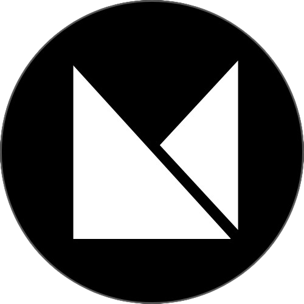

# 🧠 LeetDaily – LeetCode Daily Challenge on Your Toolbar

LeetDaily is a lightweight Chrome extension that brings the LeetCode Daily Challenge directly to your browser — helping you stay consistent with your coding practice, effortlessly.

 <!-- optional if you want to add a banner or logo -->

---

## 🔧 Features

- 🔔 **Daily Problem Preview**
  - Instantly shows the current LeetCode Daily Challenge.
  
- 📊 **Detailed Metadata**
  - Displays title, difficulty, and acceptance rate.

- 📂 **Topic Tags**
  - See associated topics for focused learning.

- 🔗 **One-click Access**
  - Quickly jump to the problem on LeetCode.com.

- ✅ **Progress Tracking**
  - Stores whether you’ve checked the daily problem.

